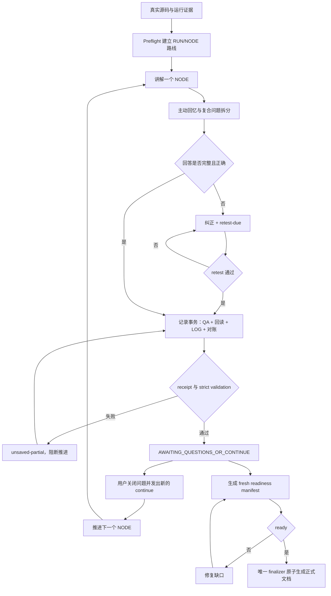

# Project Code Study

[](CHANGELOG.md)
[](LICENSE)

[简体中文](#简体中文) · [English](#english)

<a id="简体中文"></a>
## 简体中文

`project-code-study` 是一个面向真实代码项目的中文研究型学习 Skill。它把“读代码”组织成可复现、可追问、可校验的学习闭环：先从真实运行调用链建立路线，再一次只学习一个 `RUN/NODE`，通过主动回忆确认理解，最后把问答、进度、证据和学习文档持久化为可独立复习的材料。

### 它解决什么问题

长对话中的代码学习容易出现四类断裂：讲解脱离真实源码，模型把猜测说成事实；用户回答没有被逐项评价；QA/LOG/总结文件发生串写或互相矛盾；对话被压缩或中断后，学习状态丢失。这个 Skill 将这些问题拆成教学协议、持久化协议、证据核验和最终化门禁，并使用本地脚本进行严格检查。

它适合：

- 从真实运行调用链梳理深度学习、后端、工具链或其他复杂项目；
- 以“生活化例子 → 公式/规则 → 代码/语法 → 对应关系”的方式理解实现；
- 对输入输出、Shape、状态、配置、运行结果和论文对应关系进行证据化学习；
- 在长会话、上下文压缩或异常中断后继续学习，而不依赖模型记住全部历史。

它不是自动生成项目介绍的摘要器，也不是把源码逐行加注释的工具。完整代码讲解必须解释执行顺序、数据与状态变化、设计取舍、失败模式和证据边界；正式学习文档必须经过机器可验证的最终化流程。

### 核心工作流



关键规则：

| 领域 | Skill 的强制约束 |
| --- | --- |
| 路线 | 基于真实运行调用链规划；单次只推进一个 `RUN/NODE`。 |
| 证据 | 声明按类型交给对应 verifier；源码、配置、运行、数学、论文、比较和学习者判断分别核验。 |
| 问答 | 用户问题进入回答和记录流程；复合问题拆成独立 `Q-ID`；错误或部分正确回答必须复测。 |
| 持久化 | `Q/M/C/TX` 由 allocator 分配；QA 写入、精确回读、LOG 更新、跨文件对账和 strict validation 组成事务。 |
| 状态 | 保存后停在 `AWAITING_QUESTIONS_OR_CONTINUE`；旧 `continue`、未保存问题和 `retest-due` 都不能推进主线。 |
| 失败处理 | 没有机器 receipt 不能声称 `saved`；部分失败返回 `unsaved-partial` 并 fail-closed。 |
| 最终化 | 正式文档只能由唯一 finalizer 根据 fresh readiness manifest 生成；`ready=false` 时目标文件保持不变。 |
| 记忆 | 连续性记忆使用受控的文件化事实、索引、去重、更新和归档协议；恢复以 manifest 和 receipt 为准。 |

### 输出与控制面

一次正常学习循环会产生两层输出：聊天中给出结论、关键原因、证据摘要、`Q-ID`、QA 位置和当前主线状态；QA 中保存可独立阅读的规范答案。学习产物包括：

| 产物 | 作用 |
| --- | --- |
| `PROJECT_STUDY_ROUTE.md` | `RUN/NODE` 路线、上下游、完成条件和证据边界。 |
| `PROJECT_STUDY_LOG.md` | 已完成节点、问题状态、纠正、复测和事务回执。 |
| `PROJECT_STUDY_QA.md` | 完整、可独立阅读的规范问答。 |
| `.project-study-memory/MEMORY.md` | 可恢复的连续性记忆索引与当前恢复指针。 |
| `PROJECT_STUDY_FINAL.md` | 通过 readiness 后由 finalizer 生成的正式学习文档。 |

推荐从以下入口理解实现：

- [SKILL.md](SKILL.md)：运行时总协议和资源路由；
- [user-prompts.md](references/user-prompts.md)：用户意图路由，不把 QA、LOG、暂停和 readiness 门禁推回给用户；
- [prompt-workflow-patterns.md](references/prompt-workflow-patterns.md)：将外部工作流抽象为通用提示词模式；
- [continuity-memory-protocol.md](references/continuity-memory-protocol.md)：上下文压缩和异常恢复协议；
- [teaching-output-contract.md](references/teaching-output-contract.md)：代码讲解和聊天/QA 双层输出契约；
- [transaction-and-evidence-protocol.md](references/transaction-and-evidence-protocol.md)：事务、receipt、校验和证据协议；
- [scripts/](scripts/)：状态机、账本、最终化、记忆和声明门禁工具；
- [tests/](tests/)：旧测试与端到端回归测试。

### 安装

将检出的整个目录复制或链接到宿主支持的 Skill 目录，并确保运行时可以执行 Python 3。安装位置取决于宿主的 Skill 加载规则，不应写死为某个特定项目或机器路径。

常见布局示例：

```text
Claude Code 用户级：~/.claude/skills/project-code-study
Codex 用户级：      ~/.codex/skills/project-code-study
项目级：            <project>/<host-skill-directory>/project-code-study
```

请保留 `skills/project-study-document` 子目录。伴生的 [project-study-document](skills/project-study-document/SKILL.md) 负责将已验证的学习记录整理为独立 UNIT；它不能绕过主 Skill 的事务和 readiness 门禁。

首次在某个项目中启用连续性记忆时，Skill 会先询问是否允许创建项目根目录下的 `.project-study-memory/`。只有在用户明确同意后才运行 `sync_protocol_memory.py init ... --user-consent`；拒绝或未回答都不会创建。

### 快速开始

启动时只需说明项目、目标和深度：

```text
启动 project-code-study。项目根目录是 <PROJECT_ROOT>。
目标是沿真实运行调用链学习 <TOPIC>，先建立路线，然后一次讲一个 NODE。
使用中文；每个 NODE 先讲生活化例子，再讲公式/规则、代码和对应关系。
完成讲解后进行主动回忆；问题、QA、LOG、receipt 和状态由 Skill 自动维护。
```

正常继续时使用新的明确指令：

```text
继续学习下一个 NODE。
```

恢复、异常诊断和专项学习可参考 [user-prompts.md](references/user-prompts.md) 中的模板。模板只负责启动、选择讲解方式、恢复和诊断；它不要求用户手工维护记录，也不允许用户提示词绕过状态门禁。

### 验证

在提交或发布前运行：

```powershell
python -m unittest discover -s tests -p "test_*.py" -v
python scripts/validate_learning_ledger.py <PROJECT_STUDY_LOG.md> --strict --qa <PROJECT_STUDY_QA.md>
python scripts/validate_finalization_bundle.py <READINESS_MANIFEST.json> --target <PROJECT_STUDY_FINAL.md>
python scripts/validate_protocol_memory.py <MEMORY_ROOT>
python scripts/response_claim_guard.py <RESPONSE.md> --receipt <RECEIPT.json>
git diff --check
```

验证重点不是“validator 能报告错误”，而是验证错误后不存在成功旁路：正式目标文件不被创建或覆盖，没有 receipt 不能产生 `saved`，重复 ID、相邻 QA 污染、无效链接、占位路径、不完整 UNIT 和旧状态穿透都会被拒绝。

当前测试包含静态/本地回归测试；真实宿主行为、不同模型行为和跨会话持久化环境必须在对应宿主中另行验证，不能把代理测试结果当作真实宿主已通过。

### 目录结构

```text
project-code-study/
├── SKILL.md
├── README.md
├── LICENSE
├── CHANGELOG.md
├── references/
├── scripts/
├── tests/
└── skills/
    └── project-study-document/
```

### 安全与边界

- 只把项目源码、运行日志和用户明确纳入范围的材料作为输入；不要把密钥、令牌或隐私内容写入记忆、QA 或最终文档。
- 绝不把模型口头确认当作持久化成功；以 receipt、精确回读和 strict validation 为准。
- 发现证据不足时标记未知、请求补证或停止推进，不用猜测填空。
- 正式文档生成使用临时同目录文件、preflight、final validation 和原子替换；草稿只能标记为 `incomplete-draft`。
- 记录文件属于用户学习产物；Skill 的维护只修改协议、脚本、模板和测试，不覆盖已有学习记录。

### 致谢与参考项目

本 Skill 借鉴了下列公开项目或文档中的通用思想，并进行了独立抽象和实现：

| 项目/文档 | 借鉴的通用思想 | 说明 |
| --- | --- | --- |
| [Engramory](https://github.com/tinqiao-oss/engramory) | 文件化连续性记忆、受控索引、单事实记录、去重/更新/归档 | 启发了本 Skill 的 memory 协议；未复制其源代码。该仓库 README 标注为 MIT。 |
| [learn-codebase](https://github.com/ktaletsk/learn-codebase) | 苏格拉底式提问、先预测后揭示、主动回忆、渐进式支架和学习日志 | 启发了主动回忆、复测和教学输出契约；许可证以其仓库为准。 |
| [VS Code Agents documentation](https://github.com/microsoft/vscode-docs/blob/main/docs/copilot/concepts/agents.md) | Understand → Act → Validate 循环、计划阶段、动作结果反馈 | 启发了本 Skill 的执行—验证闭环；许可证以其仓库为准。 |
| [GitHub Awesome Copilot](https://github.com/github/awesome-copilot) | preflight、条件步骤、失败即停、结构化包装提示和输出契约 | 启发了提示词路由与 fail-closed 规则；许可证以其仓库为准。 |
| [Superpowers](https://github.com/obra/superpowers) | 计划检查点、分步执行、验证门和阻塞时停止 | 启发了节点推进和最终化前检查；该仓库标注为 MIT。 |
| [AGENT.md specification](https://github.com/agentmd/agent.md) | 分层指令、作用域继承和可预测的项目上下文 | 启发了资源分层与恢复入口；许可证以其仓库为准。 |
| [GitHub Copilot onboarding plan](https://docs.github.com/en/copilot/tutorials/customization-library/prompt-files/onboarding-plan) | Foundation → Exploration → Integration 的分阶段学习路径 | 启发了启动、探索、整合的提示词组织方式。 |

本项目与上述项目没有隶属、赞助或背书关系。第三方项目的版权和许可证均归其各自权利人所有；使用或再分发第三方代码、文本或资产时，应直接遵守对应仓库的 `LICENSE`、版权声明和贡献者要求。本仓库当前仅借鉴公开的工作流思想，未将上述项目的源代码、提示词原文或资产作为本 Skill 的组成部分。

### License

本项目采用 [MIT License](LICENSE)。

<a id="english"></a>
## English

`project-code-study` is a Chinese-first, evidence-bound Agent Skill for studying real software projects. It turns a verified runtime call chain into a route of `RUN/NODE` units, teaches one node at a time, evaluates active recall, and persists questions, progress, evidence, and study documents for independent review.

### What problem it solves

Long code-learning conversations can drift away from the real source, turn guesses into facts, lose learner answers, corrupt adjacent QA entries, or confuse a conversational acknowledgement with a successful write. This Skill addresses those failure modes with an executable teaching protocol, persistence transactions, claim verification, continuity memory, and finalization gates.

It is suitable for learning deep-learning, backend, tooling, and other complex repositories from their real execution paths. It is not a generic project-summary generator: copying source code and adding short comments does not qualify as a complete explanation.

### Core workflow

```text
Verified source/runtime evidence
  -> preflight and RUN/NODE route
  -> teach exactly one NODE
  -> split compound questions and run active recall
  -> evaluate, correct, and retest when needed
  -> commit QA + readback + LOG + reconciliation as one transaction
  -> require receipt and strict validation
  -> wait in AWAITING_QUESTIONS_OR_CONTINUE
  -> advance only after a new continue
  -> build a fresh readiness manifest
  -> generate the formal document through the single finalizer
```

### Core guarantees

| Area | Enforced behavior |
| --- | --- |
| Route | Build the route from a real runtime call chain and advance one `RUN/NODE` at a time. |
| Evidence | Route source, configuration, runtime, mathematical, paper, comparison, and learner-verdict claims to the appropriate verifier. |
| Questions | Enter the answer-and-record flow after a learner question; split compound intents into independent `Q-ID`s; retest incorrect or partial answers. |
| Persistence | Allocate `Q/M/C/TX` IDs uniquely; combine QA write, exact readback, LOG update, reconciliation, and strict validation into a transaction. |
| State | Stop at `AWAITING_QUESTIONS_OR_CONTINUE`; unsaved questions, stale continue tokens, and `retest-due` states cannot advance the main route. |
| Failure | Do not claim `saved` without a machine receipt; return `unsaved-partial` and fail closed on partial failure. |
| Finalization | Generate the formal document only through the finalizer after a fresh readiness manifest; preserve the target when `ready=false`. |
| Memory | Use controlled file-based facts, an index, deduplication, update, and archive rules for continuity across long or interrupted sessions. |

### Outputs and control plane

The normal loop produces two layers of output. Chat provides the conclusion, key reasons, evidence summary, `Q-ID`, QA location, and current route state. QA stores the complete, independently readable canonical answer.

| Artifact | Purpose |
| --- | --- |
| `PROJECT_STUDY_ROUTE.md` | Route, upstream/downstream nodes, completion conditions, and evidence boundaries. |
| `PROJECT_STUDY_LOG.md` | Completed nodes, question states, corrections, retests, and transaction receipts. |
| `PROJECT_STUDY_QA.md` | Complete, independently readable canonical answers. |
| `.project-study-memory/MEMORY.md` | Recoverable continuity-memory index and resume pointers. |
| `PROJECT_STUDY_FINAL.md` | Formal study document generated by the finalizer after readiness passes. |

Start with [SKILL.md](SKILL.md). Route user intent through [references/user-prompts.md](references/user-prompts.md); use [prompt-workflow-patterns.md](references/prompt-workflow-patterns.md) for abstract prompt patterns; consult the protocol references and [scripts/](scripts/) for the executable control plane.

### Installation

Copy or link the complete checked-out directory into a Skill directory supported by the host. The destination is host-specific; do not hard-code a path from one project or machine.

Typical layouts are:

```text
Claude Code user scope: ~/.claude/skills/project-code-study
Codex user scope:       ~/.codex/skills/project-code-study
Project scope:          <project>/<host-skill-directory>/project-code-study
```

Keep the `skills/project-study-document` companion directory. It turns validated study records into standalone UNITs and cannot bypass the main Skill's transaction or readiness gates.

When continuity memory is first enabled for a project, the Skill asks for explicit consent before creating `<PROJECT_ROOT>/.project-study-memory/`. A decline or missing answer creates no memory directory. The initialization command requires `--user-consent`.

### Quick start

```text
Start project-code-study for <PROJECT_ROOT>.
Study <TOPIC> from the real runtime call chain, build the route first,
then teach exactly one NODE at a time. Use Chinese and explain each NODE
through a concrete example, formula/rule, code, and correspondence.
Run active recall after teaching; maintain QA, LOG, receipts, and state internally.
```

To continue normally:

```text
Continue with the next NODE.
```

The prompt library handles startup, teaching-mode selection, recovery, and diagnostics. It does not delegate QA, LOG maintenance, pausing, or readiness gates to the learner.

### Validation

Run the following before publishing:

```powershell
python -m unittest discover -s tests -p "test_*.py" -v
python scripts/validate_learning_ledger.py <PROJECT_STUDY_LOG.md> --strict --qa <PROJECT_STUDY_QA.md>
python scripts/validate_finalization_bundle.py <READINESS_MANIFEST.json> --target <PROJECT_STUDY_FINAL.md>
python scripts/validate_protocol_memory.py <MEMORY_ROOT>
python scripts/response_claim_guard.py <RESPONSE.md> --receipt <RECEIPT.json>
git diff --check
```

Validation must also prove that no success bypass exists after a failure: the formal target remains unchanged, `saved` requires a machine receipt, duplicate IDs and boundary pollution are rejected, invalid links and placeholder paths fail, incomplete UNITs cannot validate, and stale state cannot advance the route.

The repository contains local/static regression tests. Real host behavior, cross-model behavior, and cross-session persistence must be tested in the target host separately and must not be reported as passing based only on a static proxy.

### Repository structure

```text
project-code-study/
├── SKILL.md
├── README.md
├── LICENSE
├── CHANGELOG.md
├── references/
├── scripts/
├── tests/
└── skills/
    └── project-study-document/
```

### Safety and boundaries

- Treat only repository source, runtime logs, and explicitly scoped materials as inputs; never write secrets or tokens into memory, QA, or final documents.
- Treat receipts, exact readback, and strict validation—not model acknowledgement—as proof of persistence.
- Mark unknowns and request evidence when claims cannot be verified; do not fill gaps with guesses.
- Use temporary same-directory files, preflight, final validation, and atomic replacement for formal output. Drafts must be marked `incomplete-draft`.
- Treat learner records as user-owned artifacts. Maintain the Skill by changing protocols, scripts, templates, and tests rather than overwriting study records.

### Acknowledgments

This Skill independently abstracts workflow ideas from the following public projects and documents:

| Project/document | General idea referenced | Note |
| --- | --- | --- |
| [Engramory](https://github.com/tinqiao-oss/engramory) | File-based continuity memory, bounded indexes, one-fact records, deduplication, update, and archive discipline. | Inspired the memory protocol; no source code was copied. Its README identifies the project as MIT-licensed. |
| [learn-codebase](https://github.com/ktaletsk/learn-codebase) | Socratic questioning, prediction before reveal, active recall, graduated scaffolding, and learning journals. | Inspired the recall, retest, and teaching contracts; see the upstream repository for its license. |
| [VS Code Agents documentation](https://github.com/microsoft/vscode-docs/blob/main/docs/copilot/concepts/agents.md) | Understand → Act → Validate loops, plan phases, and action-result feedback. | Inspired the execution/validation loop; see the upstream repository for its license. |
| [GitHub Awesome Copilot](https://github.com/github/awesome-copilot) | Preflight, conditional steps, fail-stop behavior, structured wrappers, and output contracts. | Inspired prompt routing and fail-closed rules; see the upstream repository for its license. |
| [Superpowers](https://github.com/obra/superpowers) | Plan checkpoints, stepwise execution, verification gates, and stopping on blockers. | Inspired node advancement and finalization checks; its repository identifies the project as MIT-licensed. |
| [AGENT.md specification](https://github.com/agentmd/agent.md) | Layered instructions, scope inheritance, and predictable project context. | Inspired resource layering and recovery entry points; see the upstream repository for its license. |
| [GitHub Copilot onboarding plan](https://docs.github.com/en/copilot/tutorials/customization-library/prompt-files/onboarding-plan) | Foundation → Exploration → Integration learning phases. | Inspired the organization of startup, exploration, and integration prompts. |

This project is not affiliated with, sponsored by, or endorsed by the projects above. Copyright and licensing remain with each respective rightsholder. If third-party code, text, or assets are later copied or redistributed, follow the corresponding upstream `LICENSE`, copyright notices, and contributor requirements. This repository currently claims only independent reuse of public workflow ideas, not upstream source code, prompt text, or assets.

### License

This Skill is released under the [MIT License](LICENSE).

See [CHANGELOG.md](CHANGELOG.md) for releases.
