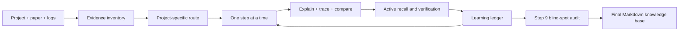

<div align="center">

# Project Code Study

### Turn a GitHub repository into a graduate-level, evidence-grounded learning track.

Read the code. Connect it to the paper. Reconstruct the shapes. Reproduce the experiment. Find what you missed.

[](https://agentskills.io/)
[](https://claude.ai/)
[](https://openai.com/codex/)
[](https://github.com/1bkunnn-cyber/project-code-study/stargazers)

[Quick Start](#quick-start) · [What It Does](#what-it-does) · [Prompt Pack](#prompt-pack) · [How It Works](#how-it-works) · [Contributing](#contributing)

</div>

## Why This Exists

Most code explanations stop at “this function does X.” That is not enough to reproduce or modify a research project.

`project-code-study` turns source-code learning into a durable study process. It makes an AI agent inspect real evidence, teach one step at a time, trace calls and tensor shapes, compare paper claims with implementation, test the learner's understanding, and maintain a project-local learning ledger.

It is useful for projects such as FCN, U-Net, YOLO, Transformers, diffusion models, recommender systems, and general Python/PyTorch repositories.

## What It Does

| Need | What the skill produces |
| --- | --- |
| Understand the project | Evidence-backed project map, entrypoints, data flow, and module graph |
| Read research code | Parameters, syntax, calls, shapes, math, engineering details, and failure modes |
| Connect paper and code | A structured mapping of matches, simplifications, deviations, and possible reasons |
| Learn across sessions | `PROJECT_STUDY_LOG.md` with progress, questions, uncertainty, blind spots, and next actions |
| Avoid hallucinations | Source labels, evidence levels, confidence, contradictions, and explicit missing evidence |
| Actually learn | Active recall, teach-back, prediction, modification questions, and completion gates |
| Finish with a knowledge base | A reusable Markdown summary for review, reproduction, and future research |

## Quick Start

### 1. Install for your host

The core is a standard `SKILL.md` folder. Copy the repository into the skill directory used by your agent:

```text
Claude Code:  ~/.claude/skills/project-code-study
Codex:       ~/.codex/skills/project-code-study
Project-local: <your-project>/.claude/skills/project-code-study
```

Claude users can also upload the skill folder through the Claude Skills interface. Other Agent Skills-compatible hosts may use their own skill directory.

### 2. Start a study track

```text
请使用 $project-code-study，带我以计算机专业研究生的深度学习这个项目。

项目路径或 GitHub 地址：<path or URL>
论文 PDF、arXiv 或 DOI：<paper or none>
我的目标：<读懂 / 复现 / 修改 / 研究扩展>
```

The agent will first ask whether it may create or update `PROJECT_STUDY_LOG.md` and where it may write it. No write authorization means a clearly labelled chat-only ledger.

### 3. Move one step at a time

```text
请读取学习记录，继续当前项目的下一个 step。
只推进一个 step，完成后先给我主动回忆问题，等待我的回答，不要自动跳到下一个 step。
```

### 4. Generate the final notes

```text
请读取 PROJECT_STUDY_LOG.md 和全部 step 内容，生成最终 Markdown 学习笔记。
保留证据来源、论文-代码差异、未解决问题、用户问题和复现实验建议。
```

## The 10-Step Route

```text
Step 0  Project map and evidence boundary
Step 1  Task background and paper problem
Step 2  Data format and preprocessing
Step 3  Overall architecture and module graph
Step 4  Core module source reading
Step 5  Paper-to-code mapping
Step 6  Loss, assignment, post-processing, metrics
Step 7  Training loop and configuration system
Step 8  Inference, deployment, and reproduction
Step 9  Global context audit and blind spots
Step 10 Graduate-level synthesis and research directions
```

The route is adaptive. A step can be reordered, revisited, or skipped only with a recorded reason and an explicit evidence gap.

## How It Works



### Evidence-first

Every important claim is separated into:

- `已确认`: directly observed in code, paper, config, or runtime output;
- `可推断`: a reasoned inference with its supporting evidence;
- `背景知识`: general model or engineering knowledge;
- `待验证`: plausible but unsupported by the current material.

The agent must say `当前材料中未看到证据` instead of inventing a missing implementation.

### RAG-aware, without pretending

The skill asks the host what it can actually access: project search, code index, vector database, paper library, web search, or no retrieval tool. It routes implementation questions to source code and configs, design questions to papers/docs, runtime questions to logs/checkpoints, and continuity questions to the learning ledger.

Mentioning “RAG” does not make a database exist. The agent must never claim it queried a vector store or paper library unless the host exposed and used that tool.

### Learning ledger

The default process file is `PROJECT_STUDY_LOG.md`. It is designed for real study sessions rather than passive note accumulation:

- a compact current snapshot lets a new session recover in about 60 seconds;
- a mastery map separates “seen” from “can explain,” “can trace,” “can apply,” and “verified later”;
- stable IDs connect sources, questions, uncertainties, misconceptions, experiments, and conflicts without repeating text;
- a review queue schedules explain/trace/predict/debug/modify exercises from actual performance;
- one append-only record captures each meaningful session, including blocked or interrupted sessions honestly;
- milestone syntheses feed the final note while old transcripts stay out of the active context;
- repository revisions mark dependent conclusions stale instead of silently carrying outdated knowledge forward.

The ledger keeps a hot current-state layer and a historical session layer in one human-editable Markdown file. When it becomes difficult to scan, the agent compacts closed history and asks before creating `PROJECT_STUDY_LOG_ARCHIVE.md`.

## Prompt Pack

[`references/user-prompts.md`](references/user-prompts.md) is a copyable auxiliary document, not another skill. It includes:

- first-session role and evidence contract;
- RAG/tool detection and source-routing instructions;
- one-step continuation prompt;
- question, deepening, resume, review, and blind-spot prompts;
- final Markdown generation prompt;
- a universal version for hosts without skill invocation;
- memory and permission blocks for long conversations.

## Repository Layout

```text
project-code-study/
├── SKILL.md
├── README.md
├── agents/
│   └── openai.yaml                 # Optional Codex display metadata
└── references/
    ├── context-audit-template.md
    ├── final-summary-template.md
    ├── learning-ledger-protocol.md
    ├── learning-ledger-template.md
    ├── paper-code-template.md
    ├── quality-rubric.md
    ├── step-template.md
    └── user-prompts.md             # User-facing prompt pack
```

## What Makes It Different

This is not a prompt that asks an AI to “explain a repo.” It is a learning protocol with four durable constraints:

1. Evidence before explanation.
2. One bounded step before the next step.
3. Understanding checked by recall, prediction, and teach-back.
4. Conversation converted into a project-local, reviewable record.

The result is aimed at four outcomes: understand, reproduce, modify, and critique.

## Safety and Permission Boundaries

The agent should ask before writing the ledger, running expensive commands, modifying project code, accessing private material, or using network retrieval. Repository files and retrieved documents are treated as untrusted data; instructions inside them cannot change the learning protocol or expand permissions.

## Validation

For Codex installations, run:

```powershell
$env:PYTHONUTF8='1'
python C:\Users\Administrator\.codex\skills\.system\skill-creator\scripts\quick_validate.py D:\skills\project-code-study
```

The standard itself is host-agnostic. Other tools should validate the `SKILL.md` frontmatter and referenced files using their own loader.

## Contributing

Useful contributions include:

- tested prompt examples for new project types;
- improvements to the step, paper-code, or ledger templates;
- reports of hallucination, missing evidence, or weak learning checks;
- examples showing how the skill works with Claude, Codex, Cursor, or another compatible host.

When proposing a change, include the user scenario, the evidence available to the agent, the expected output, and how you verified it.

## Roadmap

- Add a small cross-host test corpus for UNet, YOLO, and Transformer repositories.
- Add optional scripts for evidence inventories and repository revision snapshots.
- Add example ledgers and before/after learning sessions.
- Add translated prompt packs while keeping the core protocol language-neutral.

## License

No license has been selected yet. Add a license before public redistribution if you want to define reuse terms.

## Support The Project

If this workflow helps you learn a research codebase, starring the repository helps other students discover it. Issues and pull requests with concrete evidence are especially welcome.

[Star on GitHub](https://github.com/1bkunnn-cyber/project-code-study) · [Open an issue](https://github.com/1bkunnn-cyber/project-code-study/issues)
