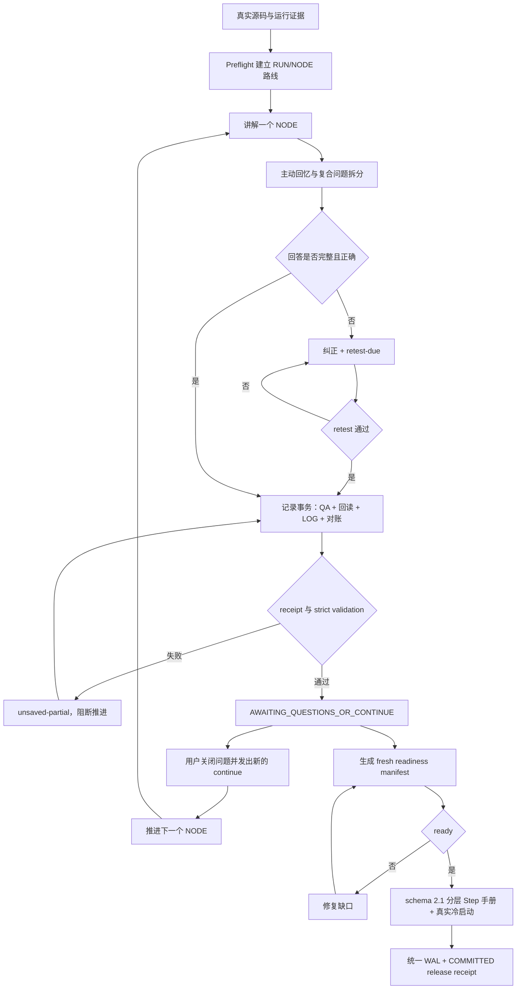

# Project Code Study

[](CHANGELOG.md)
[](LICENSE)

[简体中文](#简体中文) · [English](#english)

<a id="简体中文"></a>
## 简体中文

`project-code-study` 是一个面向真实代码项目的中文研究型学习 Skill。它把“读代码”组织成可复现、可追问、可校验的学习闭环：先从真实运行调用链建立路线，再一次只学习一个 `RUN/NODE`，通过主动回忆确认理解，最后把问答、进度、证据和学习文档持久化为可独立复习的材料。

### 它解决什么问题

长对话中的代码学习容易出现四类断裂：讲解脱离真实源码，模型把猜测说成事实；用户回答没有被逐项评价；QA/LOG/总结文件发生串写或互相矛盾；对话被压缩或中断后，学习状态丢失。这个 Skill 将这些问题拆成教学协议、持久化协议、证据核验和最终化门禁，并使用本地脚本进行严格检查。

它适合：

- 从真实运行调用链梳理深度学习、后端、工具链或其他复杂项目；
- 以“生活化例子 → 公式/规则 → 代码/语法 → 对应关系”的方式理解实现；
- 对输入输出、Shape、状态、配置、运行结果和论文对应关系进行证据化学习；
- 在长会话、上下文压缩或异常中断后继续学习，而不依赖模型记住全部历史。

它不是自动生成项目介绍的摘要器，也不是把源码逐行加注释的工具。完整代码讲解必须解释执行顺序、数据与状态变化、设计取舍、失败模式和证据边界；正式学习文档必须经过机器可验证的最终化流程。

### 核心工作流



关键规则：

| 领域 | Skill 的强制约束 |
| --- | --- |
| 路线 | 基于真实运行调用链规划；单次只推进一个 `RUN/NODE`。 |
| 证据 | 声明按类型交给对应 verifier；源码、配置、运行、数学、论文、比较和学习者判断分别核验。 |
| 问答 | 用户问题进入回答和记录流程；复合问题拆成独立 `Q-ID`；错误或部分正确回答必须复测。 |
| 持久化 | `Q/M/C/TX` 由 allocator 分配；QA 写入、精确回读、LOG 更新、跨文件对账和 strict validation 组成事务。 |
| 状态 | 保存后停在 `AWAITING_QUESTIONS_OR_CONTINUE`；旧 `continue`、未保存问题和 `retest-due` 都不能推进主线。 |
| 失败处理 | 没有机器 receipt 不能声称 `saved`；部分失败返回 `unsaved-partial` 并 fail-closed。 |
| 最终化 | 正式文档必须是可检索、可跳读的逐 Step 手册；finalizer 只产生 `release-pending`，统一 release receipt 才能证明保存。 |
| 记忆 | 普通问题不入长期记忆；偏好、纠正、质量反馈和 Step 规则只生成 candidate，经批准和事务绑定后才能 saved。 |

### v6 机制与职责边界

v6.2 把使用方式收敛为一套固定模式。用户只有一个启动提示，之后直接自然
提问、回答回忆题、纠正或说“继续”；Skill 内部始终执行
`定位 → 学习 → 检验 → 沉淀 → 等待`。七个模式为 `START`、`LEARN`、
`ASK`、`ASSESS`、`RECOVER`、`CLOSE` 和 `REPAIR`，对应不同的短响应合同，
不再让启动、问答、恢复和修复机械套用同一套八段 NODE 模板。

一次消息可包含任意数量的独立问题。系统先生成带 source span/hash 的 input
envelope，在回答前把所有问题按原顺序登记到 QA/LOG，并生成一个 intake
receipt；随后每个原 Q-ID 用独立 TX 回答和校验。某一题失败只阻断当前题，
此前已回答题保持提交，后续题保持 pending。聊天默认每轮最多展示三题只是
阅读分页，不是队列上限。追问使用新 Q-ID 和 Parent Q；同一消息里的“继续”
在出现问题或纠正时立即过期。

完整机制映射、测试边界和风险见
[v6.2 实施报告](PROJECT_CODE_STUDY_V6_2_IMPLEMENTATION_REPORT.md)。

| 产物/控制面 | 唯一职责 | 不能替代 |
| --- | --- | --- |
| `PROJECT_STUDY_QA.md` | 保存分类型、可独立阅读的完整问答；publication 模式执行 concept/code/shape/metric/review/correction 深度合同 | LOG 状态、memory、正式手册 |
| `PROJECT_STUDY_LOG.md` | 当前 Step/RUN/NODE、主线锚点、retest、pending intents、证据与事务状态 | 完整教学答案 |
| `.project-study-memory/` | 只保存获批的 durable 偏好、纠正、项目规则和证据指针 | QA/LOG、聊天转录、源代码事实 |
| `PROJECT_STUDY_DOCUMENT.md` | 每个完成 Step 的紧凑学习闭环、精选源码、检索索引、练习和答案 | 原聊天、完整源码副本或索引式摘要 |
| `release_transaction.py` | 用一份 WAL/receipt 绑定四类产物、revision、readiness、validator、cold-start 和 exact response | 宿主未执行的 hook |

memory 状态固定为 `candidate → approved → saved → stale`，另有终态
`rejected`。自动候选触发条件是：明确长期教学偏好、用户纠正、输出/文档/
路线质量反馈、Step 完成后的 durable learning rule。拒绝后删除原内容，只留
M-ID、hash、状态和原因。压缩前 handoff 必须包含主线锚点、完成 NODE、开放
问题、pending intents、retest、最近 correction、证据、artifact hash 和唯一
下一行动；hash 不一致时进入 `REPAIR_REQUIRED`。

正式手册使用 schema 2.1，目标是“翻到一个 Step 就能复习”，不是“把聊天和源码
扩写成厚教材”。每个 Step 用 8 个固定槽位：`30 秒定位`、调用链与数据边界、
精选源码证据、核心机制、设计取舍与故障定位、项目例子与重要 QA、自测与参考
答案、证据边界与下一跳。它们继续覆盖问题、前置知识、RUN/NODE、I/O/Shape/
状态、公式、设计理由、错误表现和完成标准，但不再拆成 15 个等长小节。

每个条目声明 `compact`、`standard` 或 `specialist` 阅读层级，对应 450–1,200、
800–2,200、1,400–3,600 个非代码字符。源码摘录总预算分别为 24、60、120 行，
单段最多 45 行；源文件不少于 20 行时，同一 Step 最多引用 35%。80 字以上的
非代码段落不得跨 Step 原样重复。训练、Shape、指标或创新机制可在文档内唯一的
`DEEP-DIVE-*` 深讲一次，但每个 Step 仍须先给出本地核心答案。Step 4.x、6、10
强制使用 `specialist`。schema 2.0 可继续只读迁移审计；新的正式 publication
必须是 2.1。

顶部快速索引支持按 Step、关键词、源码/符号和 Q-ID 定位。重要 QA 的完整规范
答案只在最相关 Step 正文出现一次；顶层问题区只保留 Q-ID、Step、主题、一句话
结论和正文锚点，避免二次复制。冷启动也不再只测“是否能复述”，而是依次测试
能否定位、解释和完成应用题。

### 输出与控制面

一次正常学习循环会产生两层输出：聊天中给出结论、关键原因、证据摘要、`Q-ID`、QA 位置和当前主线状态；QA 中保存可独立阅读的规范答案。学习产物包括：

| 产物 | 作用 |
| --- | --- |
| `PROJECT_STUDY_ROUTE.md` | `RUN/NODE` 路线、上下游、完成条件和证据边界。 |
| `PROJECT_STUDY_LOG.md` | 已完成节点、问题状态、纠正、复测和事务回执。 |
| `PROJECT_STUDY_QA.md` | 完整、可独立阅读的规范问答。 |
| `.project-study-memory/MEMORY.md` | 可恢复的连续性记忆索引与当前恢复指针。 |
| `PROJECT_STUDY_DOCUMENT.md` | 通过 readiness、紧凑手册 validator、真实检索/解释/应用冷启动和统一 release 后的正式学习手册。 |

推荐从以下入口理解实现：

- [SKILL.md](SKILL.md)：运行时总协议和资源路由；
- [user-prompts.md](references/user-prompts.md)：用户意图路由，不把 QA、LOG、暂停和 readiness 门禁推回给用户；
- [interaction-mode-protocol.md](references/interaction-mode-protocol.md)：七种模式、input envelope、任意问题队列和压缩恢复；
- [prompt-workflow-patterns.md](references/prompt-workflow-patterns.md)：将外部工作流抽象为通用提示词模式；
- [continuity-memory-protocol.md](references/continuity-memory-protocol.md)：上下文压缩和异常恢复协议；
- [teaching-output-contract.md](references/teaching-output-contract.md)：代码讲解和聊天/QA 双层输出契约；
- [transaction-and-evidence-protocol.md](references/transaction-and-evidence-protocol.md)：事务、receipt、校验和证据协议；
- [scripts/](scripts/)：状态机、账本、最终化、记忆和声明门禁工具；
- [tests/](tests/)：旧测试与端到端回归测试。

### 安装

将检出的整个目录复制或链接到宿主支持的 Skill 目录，并确保运行时可以执行 Python 3。安装位置取决于宿主的 Skill 加载规则，不应写死为某个特定项目或机器路径。

常见布局示例：

```text
Claude Code 用户级：~/.claude/skills/project-code-study
Codex 用户级：      ~/.codex/skills/project-code-study
项目级：            <project>/<host-skill-directory>/project-code-study
```

请保留 `skills/project-study-document` 子目录。伴生的 [project-study-document](skills/project-study-document/SKILL.md) 负责将已验证的学习记录整理为 schema 2.1 分层 Step 手册；它不能绕过主 Skill 的事务和 readiness 门禁。

首次在某个项目中启用连续性记忆时，Skill 会先询问是否允许创建项目根目录下的 `.project-study-memory/`。只有在用户明确同意后才运行 `sync_protocol_memory.py init ... --user-consent`；拒绝或未回答都不会创建。

### 快速开始

启动时只需一句自然语言；目标和基础可选：

```text
我想开始学习这个项目。目标是 <读懂 / 复现 / 修改 / 研究扩展>，
我目前了解 <一句话基础>，希望重点学习 <可留空>。
```

正常继续时使用新的明确指令：

```text
继续学习下一个 NODE。
```

之后可直接自然提问，问题数量不受协议限制；也可回答回忆题、纠正、暂停或发送新的“继续”。恢复与异常诊断见 [user-prompts.md](references/user-prompts.md) 的高级附录。用户不需要手工维护 Q-ID、QA、LOG、pending intents 或 receipt。

### 验证

在提交或发布前运行：

```powershell
python -m unittest discover -s tests -p "test_*.py" -v
python scripts/validate_learning_ledger.py <PROJECT_STUDY_LOG.md> --strict --publication --qa <PROJECT_STUDY_QA.md>
python scripts/validate_finalization_bundle.py --ledger <PROJECT_STUDY_LOG.md> --qa <PROJECT_STUDY_QA.md> --publication
python scripts/validate_protocol_memory.py <MEMORY_ROOT>
python scripts/cold_start_test.py --report <REPORT.json> --document <PROJECT_STUDY_DOCUMENT.md> --step <STEP> --handbook-schema 2.1
python skills/project-study-document/scripts/validate_study_document.py <PROJECT_STUDY_DOCUMENT.md> --ledger <LOG> --qa <QA> --repo-root <PROJECT_ROOT> --publication --cold-start-report <REPORT.json>
python scripts/release_transaction.py prepare --manifest <RELEASE_MANIFEST.json> --wal <RELEASE.wal.json> --response-file <RESPONSE.md>
python scripts/release_transaction.py commit --wal <RELEASE.wal.json> --receipt <RELEASE.receipt.json>
python scripts/response_claim_guard.py <RESPONSE.md> --receipt <RECEIPT.json>
git diff --check
```

验证重点不是“validator 能报告错误”，而是验证错误后不存在成功旁路：正式目标文件不被创建或覆盖，没有 receipt 不能产生 `saved`，重复 ID、相邻 QA 污染、无效链接、占位路径、不完整 UNIT 和旧状态穿透都会被拒绝。

当前脚本能强制本地文件、状态、hash 和 receipt 约束，但不能凭 Skill 文本给宿主安装 pre-response 或真实 compact hook。真实宿主、不同模型、真实上下文压缩必须分别测试；未执行项写 `not-run`，静态 validator 通过不能替代宿主通过。

### 目录结构

```text
project-code-study/
├── SKILL.md
├── README.md
├── LICENSE
├── CHANGELOG.md
├── references/
├── scripts/
├── tests/
└── skills/
    └── project-study-document/
```

### 安全与边界

- 只把项目源码、运行日志和用户明确纳入范围的材料作为输入；不要把密钥、令牌或隐私内容写入记忆、QA 或最终文档。
- 绝不把模型口头确认当作持久化成功；以 receipt、精确回读和 strict validation 为准。
- 发现证据不足时标记未知、请求补证或停止推进，不用猜测填空。
- 正式文档生成使用临时同目录文件、preflight、final validation 和原子替换；草稿只能标记为 `incomplete-draft`。
- 记录文件属于用户学习产物；Skill 的维护只修改协议、脚本、模板和测试，不覆盖已有学习记录。

### 致谢与参考项目

本 Skill 借鉴了下列公开项目或文档中的通用思想，并进行了独立抽象和实现：

完整的仓库链接、核心实现方式、许可证、审计日活跃程度、适用性分类和明确
拒绝项见 [GitHub 调研与致谢](GITHUB_RESEARCH_AND_ACKNOWLEDGEMENTS.md)。
特别感谢 Engramory、Mem0、Letta、Zep Graphiti、LangGraph、OpenHands、
SWE-agent、Aider、AutoGen、CrewAI、learn-codebase、PocketFlow Tutorial
Codebase Knowledge、RepoAgent、CodeTour、DeepWiki-Open、Diátaxis、
Material for MkDocs、mdBook、Rust by Example、Log4brains、MathTutorBench 和
EducationQ，以及 GitHub Copilot customization、Claude Code skills、
Anthropic skill-creator、Superpowers 和 awesome-copilot 的维护者与研究者
公开相关思想。

| 项目/文档 | 借鉴的通用思想 | 说明 |
| --- | --- | --- |
| [Engramory](https://github.com/tinqiao-oss/engramory) | 文件化连续性记忆、受控索引、单事实记录、去重/更新/归档 | 启发了本 Skill 的 memory 协议；未复制其源代码。该仓库 README 标注为 MIT。 |
| [CodeTour](https://github.com/microsoft/codetour) | 有序代码导览、文件/行选择、primary tour 与下一跳 | 启发了 Step 顺序、精选源码锚点和前后导航；未复制其扩展代码。 |
| [Diátaxis](https://github.com/evildmp/diataxis-documentation-framework) | tutorial/how-to/reference/explanation 分工和按需深入 | 启发了“Step 核心闭环 + 检索索引 + 共享深讲”的分层结构；其文档为 CC-BY-SA 4.0，本仓库只借鉴思想。 |
| [Material for MkDocs](https://github.com/squidfunk/mkdocs-material) 与 [mdBook](https://github.com/rust-lang/mdBook) | 搜索、目录、锚点、前后导航和源码归属 | 启发了单 Markdown 内的快速索引；未引入站点运行时。 |
| [Rust by Example](https://github.com/rust-lang/rust-by-example) | 小而完整的例子和可应用练习 | 启发了每 Step 一个项目最小例子；未复制示例内容。 |
| [Log4brains](https://github.com/thomvaill/log4brains) | 轻量 Markdown、可搜索元数据和渐进披露 | 启发了内容预算、去重和可选深读；未复制其实现。 |
| [learn-codebase](https://github.com/ktaletsk/learn-codebase) | 苏格拉底式提问、先预测后揭示、主动回忆、渐进式支架和学习日志 | 启发了主动回忆、复测和教学输出契约；许可证以其仓库为准。 |
| [VS Code Agents documentation](https://github.com/microsoft/vscode-docs/blob/main/docs/copilot/concepts/agents.md) | Understand → Act → Validate 循环、计划阶段、动作结果反馈 | 启发了本 Skill 的执行—验证闭环；许可证以其仓库为准。 |
| [GitHub Awesome Copilot](https://github.com/github/awesome-copilot) | preflight、条件步骤、失败即停、结构化包装提示和输出契约 | 启发了提示词路由与 fail-closed 规则；许可证以其仓库为准。 |
| [Superpowers](https://github.com/obra/superpowers) | 计划检查点、分步执行、验证门和阻塞时停止 | 启发了节点推进和最终化前检查；该仓库标注为 MIT。 |
| [AGENT.md specification](https://github.com/agentmd/agent.md) | 分层指令、作用域继承和可预测的项目上下文 | 启发了资源分层与恢复入口；许可证以其仓库为准。 |
| [GitHub Copilot onboarding plan](https://docs.github.com/en/copilot/tutorials/customization-library/prompt-files/onboarding-plan) | Foundation → Exploration → Integration 的分阶段学习路径 | 启发了启动、探索、整合的提示词组织方式。 |
| [GitHub Copilot customization](https://docs.github.com/en/copilot/customizing-copilot/about-customizing-github-copilot-chat-responses)、[Claude Code skills](https://docs.anthropic.com/en/docs/claude-code/skills) 与 [Anthropic skill-creator](https://github.com/anthropics/skills/tree/main/skills/skill-creator) | 用户输入、Skill、按需资源和宿主 hook 的职责分层；渐进披露 | 启发了 v6.2 单启动入口、短合同和协议资源分层；未复制提示词或协议。 |

本项目与上述项目没有隶属、赞助或背书关系。第三方项目的版权和许可证均归其各自权利人所有；使用或再分发第三方代码、文本或资产时，应直接遵守对应仓库的 `LICENSE`、版权声明和贡献者要求。本仓库当前仅借鉴公开的工作流思想，未将上述项目的源代码、提示词原文或资产作为本 Skill 的组成部分。

### License

本项目采用 [MIT License](LICENSE)。

<a id="english"></a>
## English

`project-code-study` is a Chinese-first, evidence-bound Agent Skill for studying real software projects. It turns a verified runtime call chain into a route of `RUN/NODE` units, teaches one node at a time, evaluates active recall, and persists questions, progress, evidence, and study documents for independent review.

Version 6.2 adds one natural start prompt, the standard
`locate → learn → assess → persist → wait` loop, seven response modes, a
source-bound intent envelope, and arbitrary-size question batches that register
every Q before answering and commit each answer independently. It retains the
compact schema 2.1 Step-manual entries, quick lookup indexes,
reading and source-excerpt budgets, cross-Step duplication checks, document-local
deep dives, and retrieval/explanation/application cold-start reports. It keeps
the v6 typed durable-memory candidates, hash-bound compaction handoffs,
type-specific QA depth contracts, exact source evidence, and one WAL-backed
release receipt binding QA, LOG, memory, document, validators, source revision,
not-run boundaries, and the exact response. See the
[research and acknowledgements table](GITHUB_RESEARCH_AND_ACKNOWLEDGEMENTS.md)
for upstream ideas, licenses, activity, adoption decisions, and explicit
non-adoptions.
See the [v6.2 implementation report](PROJECT_CODE_STUDY_V6_2_IMPLEMENTATION_REPORT.md)
for the mechanism map, verification matrix, not-run boundaries, and risks.

### What problem it solves

Long code-learning conversations can drift away from the real source, turn guesses into facts, lose learner answers, corrupt adjacent QA entries, or confuse a conversational acknowledgement with a successful write. This Skill addresses those failure modes with an executable teaching protocol, persistence transactions, claim verification, continuity memory, and finalization gates.

It is suitable for learning deep-learning, backend, tooling, and other complex repositories from their real execution paths. It is not a generic project-summary generator: copying source code and adding short comments does not qualify as a complete explanation.

### Core workflow

```text
Verified source/runtime evidence
  -> preflight and RUN/NODE route
  -> teach exactly one NODE
  -> split compound questions and run active recall
  -> evaluate, correct, and retest when needed
  -> commit QA + readback + LOG + reconciliation as one transaction
  -> require receipt and strict validation
  -> wait in AWAITING_QUESTIONS_OR_CONTINUE
  -> advance only after a new continue
  -> build a fresh readiness manifest
  -> build schema 2.1 layered Step-manual entries
  -> run a real fresh-model/document-only lookup, explanation, and application cold-start
  -> stage through the finalizer
  -> commit one hash-bound release receipt
```

### Core guarantees

| Area | Enforced behavior |
| --- | --- |
| Route | Build the route from a real runtime call chain and advance one `RUN/NODE` at a time. |
| Evidence | Route source, configuration, runtime, mathematical, paper, comparison, and learner-verdict claims to the appropriate verifier. |
| Questions | Enter the answer-and-record flow after a learner question; split compound intents into independent `Q-ID`s; retest incorrect or partial answers. |
| Question batches | Register every source-bound Q before the first answer; update one existing Q per TX; preserve earlier commits and later pending Qs after a failure. |
| Persistence | Allocate `Q/M/C/TX` IDs uniquely; combine QA write, exact readback, LOG update, reconciliation, and strict validation into a transaction. |
| State | Stop at `AWAITING_QUESTIONS_OR_CONTINUE`; unsaved questions, stale continue tokens, and `retest-due` states cannot advance the main route. |
| Failure | Do not claim `saved` without a COMMITTED release receipt bound to the exact response; return `unsaved-partial` or `release-pending`. |
| Finalization | Require schema 2.1 compact entries, selected exact source excerpts, real retrieval/explanation/application cold-start, and one release receipt; preserve the target when `ready=false`. |
| Memory | Create candidates only for durable preferences, corrections, quality feedback, and Step rules; approve/reject explicitly and restore from hash-bound handoffs. |

The final document is a manual to consult, not a textbook dump. Each Step uses
eight slots: quick orientation; call/data boundary; selected source evidence;
core mechanism; trade-offs and failure diagnosis; project example and selected
QA; self-test and answer; evidence boundary and next hop. `compact`, `standard`,
and `specialist` profiles cap non-code prose at 1,200, 2,200, and 3,600
characters and total excerpts at 24, 60, and 120 lines. One excerpt is at most
45 lines, a long source file may be quoted at most 35%, and long prose
paragraphs cannot be copied across Steps. Shared mechanisms live once under a
document-local `DEEP-DIVE-*`; each Step still contains its local answer.

### Outputs and control plane

The normal loop produces two layers of output. Chat provides the conclusion, key reasons, evidence summary, `Q-ID`, QA location, and current route state. QA stores the complete, independently readable canonical answer.

| Artifact | Purpose |
| --- | --- |
| `PROJECT_STUDY_ROUTE.md` | Route, upstream/downstream nodes, completion conditions, and evidence boundaries. |
| `PROJECT_STUDY_LOG.md` | Completed nodes, question states, corrections, retests, and transaction receipts. |
| `PROJECT_STUDY_QA.md` | Complete, independently readable canonical answers. |
| `.project-study-memory/MEMORY.md` | Recoverable continuity-memory index and resume pointers. |
| `PROJECT_STUDY_DOCUMENT.md` | Formal per-Step manual released after readiness, schema 2.1 compactness/source/navigation validation, real cold-start, and one committed receipt. |

Start with [SKILL.md](SKILL.md). The learner uses the single start prompt and natural follow-ups in [references/user-prompts.md](references/user-prompts.md); [interaction-mode-protocol.md](references/interaction-mode-protocol.md) defines the seven modes and arbitrary question queue; consult the remaining protocol references and [scripts/](scripts/) for the executable control plane.

### Installation

Copy or link the complete checked-out directory into a Skill directory supported by the host. The destination is host-specific; do not hard-code a path from one project or machine.

Typical layouts are:

```text
Claude Code user scope: ~/.claude/skills/project-code-study
Codex user scope:       ~/.codex/skills/project-code-study
Project scope:          <project>/<host-skill-directory>/project-code-study
```

Keep the `skills/project-study-document` companion directory. It turns validated study records into searchable schema 2.1 Step-manual entries and cannot bypass the main Skill's transaction, cold-start, or release gates.

When continuity memory is first enabled for a project, the Skill asks for explicit consent before creating `<PROJECT_ROOT>/.project-study-memory/`. A decline or missing answer creates no memory directory. The initialization command requires `--user-consent`.

### Quick start

```text
I want to start learning this project. My goal is <understand / reproduce /
modify / research-extend>; my current background is <optional>.
```

To continue normally:

```text
Continue with the next NODE.
```

After that, ask any number of questions naturally, answer recall, correct a claim, pause, or send a fresh continue. The Skill—not the learner—maintains Q IDs, QA/LOG, queues, receipts, recovery, and readiness gates.

### Validation

Run the following before publishing:

```powershell
python -m unittest discover -s tests -p "test_*.py" -v
python scripts/validate_skill_structure.py
python scripts/validate_learning_ledger.py <PROJECT_STUDY_LOG.md> --strict --publication --qa <PROJECT_STUDY_QA.md>
python scripts/validate_finalization_bundle.py --ledger <PROJECT_STUDY_LOG.md> --qa <PROJECT_STUDY_QA.md> --publication
python scripts/validate_protocol_memory.py <MEMORY_ROOT>
python scripts/cold_start_test.py --report <REPORT.json> --document <PROJECT_STUDY_DOCUMENT.md> --step <STEP> --handbook-schema 2.1
python skills/project-study-document/scripts/validate_study_document.py <DOCUMENT> --ledger <LOG> --qa <QA> --repo-root <PROJECT_ROOT> --publication --cold-start-report <REPORT.json>
python scripts/release_transaction.py prepare --manifest <MANIFEST.json> --wal <WAL.json> --response-file <RESPONSE.md>
python scripts/release_transaction.py commit --wal <WAL.json> --receipt <RECEIPT.json>
python scripts/response_claim_guard.py <RESPONSE.md> --receipt <RECEIPT.json>
git diff --check
```

Validation must also prove that no success bypass exists after a failure: the formal target remains unchanged, `saved` requires one committed release receipt, duplicate IDs and boundary pollution are rejected, invalid or over-budget source excerpts fail, shallow or bloated entries cannot validate, repeated long paragraphs fail, and stale state cannot advance the route.

The repository contains local/static regression tests. Real host behavior, cross-model behavior, and cross-session persistence must be tested in the target host separately and must not be reported as passing based only on a static proxy.

### Repository structure

```text
project-code-study/
├── SKILL.md
├── README.md
├── LICENSE
├── CHANGELOG.md
├── references/
├── scripts/
├── tests/
└── skills/
    └── project-study-document/
```

### Safety and boundaries

- Treat only repository source, runtime logs, and explicitly scoped materials as inputs; never write secrets or tokens into memory, QA, or final documents.
- Treat receipts, exact readback, and strict validation—not model acknowledgement—as proof of persistence.
- Mark unknowns and request evidence when claims cannot be verified; do not fill gaps with guesses.
- Use temporary same-directory files, preflight, final validation, and atomic replacement for formal output. Drafts must be marked `incomplete-draft`.
- Treat learner records as user-owned artifacts. Maintain the Skill by changing protocols, scripts, templates, and tests rather than overwriting study records.

### Acknowledgments

This Skill independently abstracts workflow ideas from the following public projects and documents:

| Project/document | General idea referenced | Note |
| --- | --- | --- |
| [Engramory](https://github.com/tinqiao-oss/engramory) | File-based continuity memory, bounded indexes, one-fact records, deduplication, update, and archive discipline. | Inspired the memory protocol; no source code was copied. Its README identifies the project as MIT-licensed. |
| [CodeTour](https://github.com/microsoft/codetour) | Ordered code tours, file/line selections, primary tours, and next-step navigation. | Inspired Step ordering, selected source anchors, and continuation links; no extension code was copied. |
| [Diátaxis](https://github.com/evildmp/diataxis-documentation-framework) | Separation of tutorial, how-to, reference, and explanation, with deeper material available on demand. | Inspired the local Step closure, lookup index, and shared deep-dive layers; ideas only. |
| [Material for MkDocs](https://github.com/squidfunk/mkdocs-material) and [mdBook](https://github.com/rust-lang/mdBook) | Search, tables of contents, anchors, breadcrumbs, and previous/next navigation. | Inspired navigation inside one Markdown artifact; no site runtime was added. |
| [Rust by Example](https://github.com/rust-lang/rust-by-example) | Small, complete examples and application-oriented learning. | Inspired one minimal project example per Step; no examples were copied. |
| [Log4brains](https://github.com/thomvaill/log4brains) | Lightweight searchable Markdown knowledge and progressive disclosure. | Inspired content budgets, deduplication, and optional deeper reading; no implementation was copied. |
| [learn-codebase](https://github.com/ktaletsk/learn-codebase) | Socratic questioning, prediction before reveal, active recall, graduated scaffolding, and learning journals. | Inspired the recall, retest, and teaching contracts; see the upstream repository for its license. |
| [VS Code Agents documentation](https://github.com/microsoft/vscode-docs/blob/main/docs/copilot/concepts/agents.md) | Understand → Act → Validate loops, plan phases, and action-result feedback. | Inspired the execution/validation loop; see the upstream repository for its license. |
| [GitHub Awesome Copilot](https://github.com/github/awesome-copilot) | Preflight, conditional steps, fail-stop behavior, structured wrappers, and output contracts. | Inspired prompt routing and fail-closed rules; see the upstream repository for its license. |
| [Superpowers](https://github.com/obra/superpowers) | Plan checkpoints, stepwise execution, verification gates, and stopping on blockers. | Inspired node advancement and finalization checks; its repository identifies the project as MIT-licensed. |
| [AGENT.md specification](https://github.com/agentmd/agent.md) | Layered instructions, scope inheritance, and predictable project context. | Inspired resource layering and recovery entry points; see the upstream repository for its license. |
| [GitHub Copilot onboarding plan](https://docs.github.com/en/copilot/tutorials/customization-library/prompt-files/onboarding-plan) | Foundation → Exploration → Integration learning phases. | Inspired the organization of startup, exploration, and integration prompts. |
| [GitHub Copilot customization](https://docs.github.com/en/copilot/customizing-copilot/about-customizing-github-copilot-chat-responses), [Claude Code skills](https://docs.anthropic.com/en/docs/claude-code/skills), and [Anthropic skill-creator](https://github.com/anthropics/skills/tree/main/skills/skill-creator) | Separation of user input, reusable Skill workflows, scoped resources, and host hooks; progressive disclosure. | Inspired v6.2's single entry point, short mode contracts, and layered protocols; no prompt or protocol text was copied. |

This project is not affiliated with, sponsored by, or endorsed by the projects above. Copyright and licensing remain with each respective rightsholder. If third-party code, text, or assets are later copied or redistributed, follow the corresponding upstream `LICENSE`, copyright notices, and contributor requirements. This repository currently claims only independent reuse of public workflow ideas, not upstream source code, prompt text, or assets.

### License

This Skill is released under the [MIT License](LICENSE).

See [CHANGELOG.md](CHANGELOG.md) for releases.
