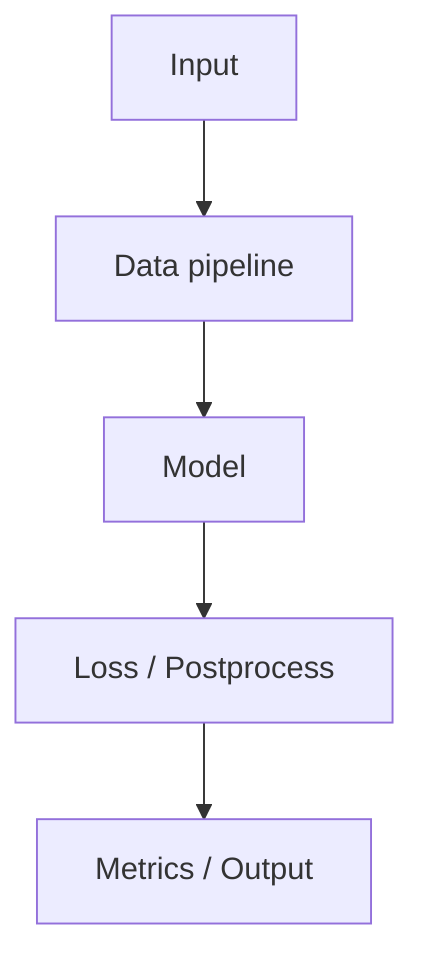

# Final Markdown Summary Template

Use this structure when the user asks for final notes.

Prefer the project's `PROJECT_STUDY_LOG.md` learning ledger as the source for completed steps, demonstrated mastery, milestone syntheses, user心得, user feedback, user questions, route adjustments, unresolved uncertainties, misconceptions, experiments, and reusable summary material. Resolve referenced stable IDs through the source/evidence register. Do not treat self-confidence, exposure, or a `done` step label as proof of understanding. If no ledger was saved, use the temporary conversation ledger.

# <Project Name> 源码学习笔记

## 1. 项目概览

- Project:
- Task:
- Framework:
- Main entrypoints:
- Evidence scope:
- Important missing evidence:

## 2. 论文背景与核心思想

- Paper:
- Problem:
- Main idea:
- Key modules:
- Key formulas:
- What is paper evidence vs general background:

## 3. 学习路线

| Step | Topic | Status | Demonstrated exit evidence | Key takeaway |
| --- | --- | --- | --- | --- |
| 0 | Project map |  |  |  |
| 1 | Task and paper problem |  |  |  |
| 2 | Data and preprocessing |  |  |  |
| 3 | Architecture |  |  |  |
| 4 | Core source reading |  |  |  |
| 5 | Paper-code mapping |  |  |  |
| 6 | Loss/postprocess/metrics |  |  |  |
| 7 | Training/config |  |  |  |
| 8 | Inference/reproduction |  |  |  |
| 9 | Context audit |  |  |  |
| 10 | Graduate synthesis |  |  |  |

## 4. 模块关系

Describe the architecture and call relationships. Use Mermaid if helpful.

## 5. 关键代码精读

For each key file/module:

- File:
- Class/function:
- Parameters:
- Role:
- Code logic:
- Calls:
- Paper relation:
- Common mistakes:

## 6. Shape Flow

| Stage | Tensor | Shape | Meaning | Evidence |
| --- | --- | --- | --- | --- |
|  |  |  |  |  |

## 7. Paper-Code Mapping

| Paper concept | Code implementation | Status | Notes |
| --- | --- | --- | --- |
|  |  | Match / Simplified / Changed / Missing / Unclear |  |

## 8. Data, Training, Inference, Evaluation

- Data format:
- Preprocessing:
- Training loop:
- Loss:
- Optimizer/scheduler:
- Inference:
- Post-processing:
- Metrics:
- Reproduction commands:
- Missing runtime evidence:

## 9. 全局盲点审计

- Important ignored points:
- AI uncertainty:
- Biggest current regret/gap:
- User may not realize:
- Evidence needed next:
- Route adjustments from the learning ledger:
- Unresolved questions carried forward:
- Misconceptions still due for retest:
- Stale conclusions caused by repository changes:

## 10. 用户问题与回答

| ID | Step | Question | Answer | Evidence IDs |
| --- | --- | --- | --- | --- |
| Q-... |  |  |  | SRC-... |

## 10.1 用户心得与学习感受

Summarize the learner's own reflections without replacing their wording with an AI judgment.

| 心得 ID | Step | 用户真正理解的内容 | 仍然困难的内容 | 用户希望的调整 |
| --- | --- | --- | --- | --- |
| NOTE-... |  |  |  |  |

## 10.2 用户反馈与 AI 调整

Include unresolved, low-rated, recurring, and representative feedback. Explain how the teaching changed in response.

| Feedback ID | Step | 用户反馈 | 评分 | AI 调整 | 处理状态 | 后续动作 |
| --- | --- | --- | --- | --- | --- | --- |
| FB-... |  |  |  |  |  |  |

## 11. 易错点与调试清单

- Environment:
- Data:
- Shape:
- Config:
- Model:
- Loss:
- Evaluation:
- Reproduction:

## 12. 术语表

| Term | Meaning | Project-specific note |
| --- | --- | --- |
|  |  |  |

## 13. 后续阅读与实验建议

- Papers to read:
- Code paths to inspect:
- Experiments to reproduce:
- Ablations to try:
- Modifications worth implementing:
- Review queue carried forward:
- Single highest-value next action:
